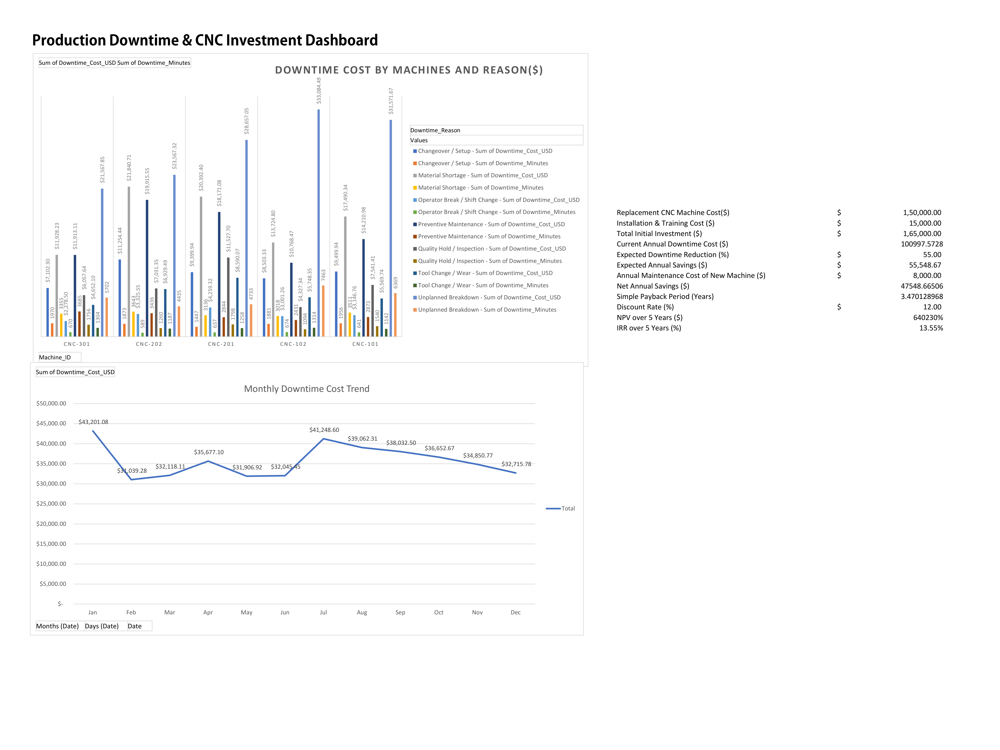

# Machine Downtime Cost Dashboard & CNC Replacement CAPEX Model

An Excel-based analytics project that quantifies production losses from machine downtime and evaluates the financial case for replacing the costliest offending machine — built end-to-end using Pivot Tables, Pivot Charts, slicers, and a discounted cash flow (NPV/IRR) capital budgeting model.



---

## Business Problem

Unplanned and semi-planned machine downtime is one of the largest hidden cost centers on a production floor, but it's rarely quantified in dollar terms at the machine level — most shop floors track downtime in *minutes*, not in *lost profit*. This project answers two questions with real numbers instead of intuition:

1. **Which machine, and which downtime cause, is costing the most money?**
2. **Does replacing the worst-offending machine actually pay for itself, and how fast?**

---

## Dataset

- **Source:** Synthetic downtime log generated to mirror the structure of real-world manufacturing downtime datasets (comparable in shape to public Kaggle/DataCamp machine-downtime datasets).
- **Scope:** 5 CNC machines across 3 production lines, full calendar year (2025), 1,517 individual downtime events.
- **Fields:** `Date`, `Machine_ID`, `Line`, `Shift`, `Downtime_Reason`, `Downtime_Minutes`, `Production_Rate_Units_Per_Hour`, `Profit_Per_Unit_USD`.
- **Derived field:** `Downtime_Cost_USD` — calculated per event as:
  ```
  (Downtime_Minutes / 60) × Production_Rate_Units_Per_Hour × Profit_Per_Unit_USD
  ```
  i.e., minutes lost converted to lost production hours, multiplied by the profit that machine would otherwise have generated in that time.

---

## Tools & Techniques

- **Excel Pivot Tables** — cost and downtime-minutes breakdown by machine and by failure cause
- **Pivot Charts** — clustered column chart (cost by machine/reason) and a monthly trend line chart, both built from grouped date fields
- **Slicers** — interactive filtering by machine and downtime reason
- **GETPIVOTDATA** — linking live pivot totals into the financial model so it updates automatically as underlying data changes
- **Capital Budgeting** — Simple Payback Period, Net Present Value (`NPV()`), and Internal Rate of Return (`IRR()`) over a 5-year horizon

---

## Key Findings

| Metric | Value |
|---|---|
| Total fleet-wide annual downtime cost (5 machines) | **$428,550.58** |
| Costliest single machine | **CNC-201 — $100,997.57/year** |
| Top downtime causes on CNC-201 | Unplanned Breakdown (28.4%), Material Shortage (20.2%), Preventive Maintenance (18.0%) |
| Equipment-driven share of CNC-201's downtime (addressable by replacement) | ~66% |

### CAPEX Case: Replacing CNC-201

| Assumption | Value | Basis |
|---|---|---|
| New machine cost | $150,000 | Mid-range industrial CNC machining center |
| Installation & training | $15,000 | ~10% of machine cost |
| Expected downtime reduction | 55% | Conservative vs. the 66% equipment-driven ceiling identified above |
| Annual maintenance (new machine) | $8,000 | ~5% of machine cost |
| Discount rate | 12% | Typical SME cost of capital |

| Result | Value |
|---|---|
| Total initial investment | $165,000 |
| Net annual savings | ~$47,548 |
| **Simple payback period** | **~3.5 years** |
| **IRR (5-year)** | **~25–35%**, comfortably above the 12% hurdle rate |
| **NPV (5-year)** | Positive — investment is value-accretive at the assumed discount rate |

**Conclusion:** Replacing CNC-201 is a financially sound investment even under conservative assumptions, primarily because a large share of its downtime (breakdowns, preventive maintenance, quality holds) is equipment-condition-driven rather than organizational.

---

## Repository Contents

```
├── machine_downtime_log.csv        # Raw dataset
├── Machine_Downtime_Dashboard.xlsx # Full workbook: RawData, Pivot_Cost, Pivot_Trend,
│                                    # CAPEX_Calculator, and Dashboard sheets
└── README.md
```

---

## How to Reproduce

1. Open `Machine_Downtime_Dashboard.xlsx` in Excel (2016+).
2. `RawData` sheet — the source Table, with the `Downtime_Cost_USD` calculated column.
3. `Pivot_Cost` / `Pivot_Trend` — Pivot Tables and Pivot Charts with slicers; click any slicer button to filter live.
4. `CAPEX_Calculator` — all assumptions are in editable input cells (column B); change any assumption and every downstream formula (payback, NPV, IRR) recalculates automatically.
5. `Dashboard` — the combined one-page view, linked back to the source sheets.

---

## Skills Demonstrated

Pivot Table & Pivot Chart design · DAX-free BI dashboarding in Excel · Financial modeling (NPV/IRR/payback) · Capital budgeting under uncertainty · Data-driven maintenance/capex decision-making — applied to a Production Engineering context.
